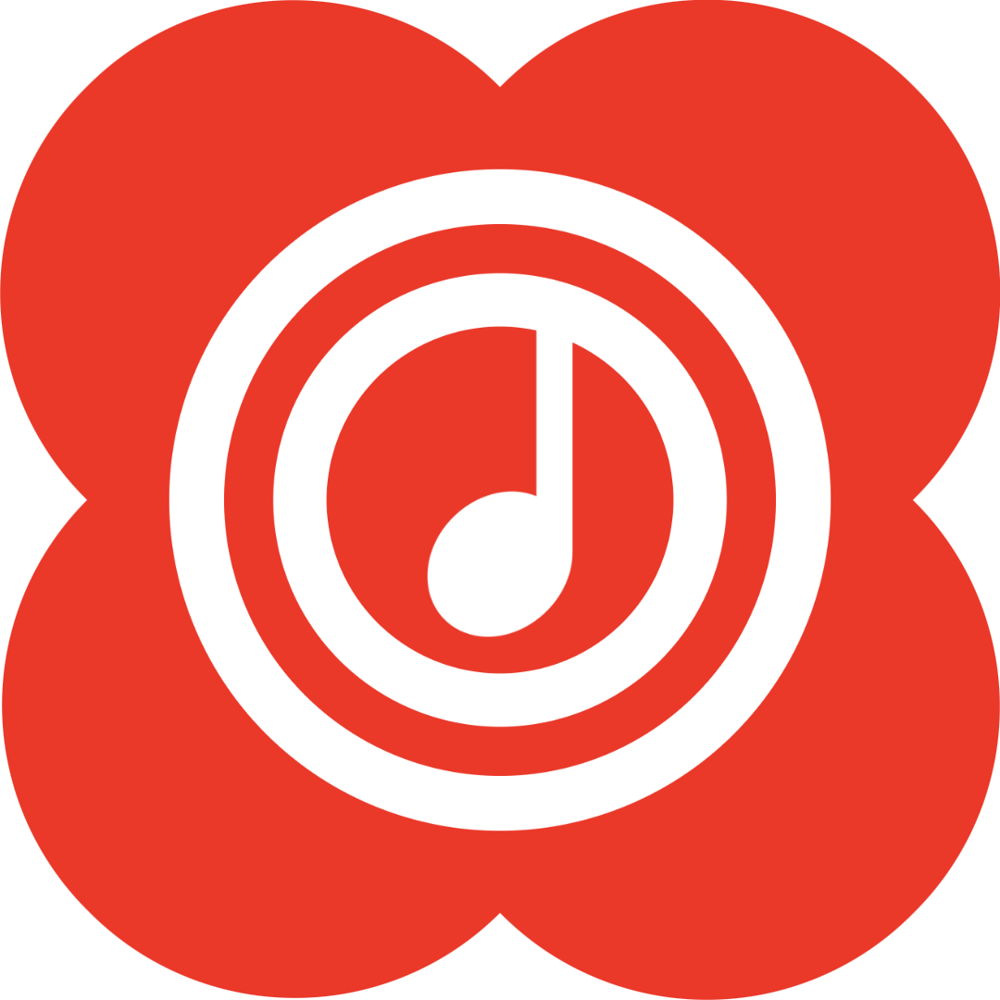

<div align="center">



# Echo Music Desktop

**The desktop port of [Echo Music](https://github.com/EchoMusicApp/Echo-Music)** — ad-free YouTube Music streaming, synced lyrics and offline playback, rebuilt from the ground up in Rust.

[](../../actions/workflows/ci.yml)
[](../../actions/workflows/release.yml)
[](LICENSE)

</div>

---

## Why Rust + Slint

The upstream app is Kotlin + Jetpack Compose. This port keeps the *product* — the same features, the same visual language, the same data model — and changes the *substrate*:

| | |
|---|---|
| **Language** | Rust — no GC pauses, no runtime, memory-safe, `opt-level = 3` + thin LTO |
| **UI** | [Slint](https://slint.dev) — GPU-accelerated native rendering, compiled declaratively at build time |
| **Binary** | A single self-contained executable, roughly 15–25 MB with no runtime to install |
| **Threading** | One thread per concern (UI, audio, network), coordinated by channels — the UI never blocks |

Nothing is downloaded at install time, nothing is interpreted at runtime, and the audio path never leaves native code.

---

## Features

Everything below is implemented natively — there is no wrapper around a web player.

**Streaming & playback**
- Ad-free streaming from the full YouTube Music catalogue via a native InnerTube client
- Offline downloads with a dedicated download manager
- Gapless playback, crossfade with configurable overlap, sleep timer
- 10-band parametric equalizer (biquad filters) and stereo widener
- Shuffle, repeat-one, repeat-all, seek, volume, mute

**Discovery**
- Personalised home feed with mood / genre chips
- Search across songs, videos, albums, artists and playlists
- Type-ahead search suggestions
- Album, artist, playlist and charts pages
- Explore, moods & genres, new releases

**Lyrics**
- Six providers, tried in a user-configurable order:
  **LRCLIB · BetterLyrics · SimpMusic · YouLy+ · Kugou · Paxsenix**
- Word-by-word (enhanced LRC) and line-synced display, plus TTML parsing
- Per-query caching, so scrolling the lyrics view never re-hits the network

**Library**
- Liked songs, user playlists, play history, most/least played
- Downloaded tracks, search history
- All persisted in a local SQLite database

**Extras**
- Discord Rich Presence — your current track, artist, album and a live progress
  counter on your Discord profile, with pause/resume reflected immediately

**Design**
- The Echo palette generated from the seed `#ED5564`, applied as a full Material-3 tonal scheme
- Liquid-glass surfaces, pill chips, 24px rounded cards, floating tab bar
- The Echo clover mark, including as the player's primary transport button
- Pure-black (OLED) mode and switchable accent colours

---

## Architecture

A Cargo workspace with a strict dependency direction — `echo-app` depends on everything, nothing depends on `echo-app`.

```
crates/
├── echo-core        Domain models, settings, SQLite library, colour system
├── echo-innertube   Native YouTube Music client (search / browse / player / cipher)
├── echo-playback    rodio + symphonia audio engine, queue, equalizer
├── echo-lyrics      Lyrics providers, LRC / enhanced-LRC / TTML parsers
├── echo-discord     Discord Rich Presence IPC client
└── echo-app         Slint UI + application wiring (the binary)
```

### `echo-innertube` — the streaming engine

This is a direct port of the upstream `:innertube` module.

- **Client chain.** YouTube gates stream delivery per client identity, so a set of known-good clients is walked in priority order until one returns playable formats: `ANDROID_VR 1.65.10` → `IOS` → `TVHTML5_SIMPLY_EMBEDDED_PLAYER` → `ANDROID_VR 1.43.32` → `WEB_REMIX` → `ANDROID`.
- **Response parsing** is tree-walking rather than path-bound: it looks for renderer names anywhere in the response, so it survives the reshuffles YouTube performs regularly.
- **Signature cipher.** Some formats return a `signatureCipher` instead of a URL. Rather than shipping a JavaScript engine, the decipher routine is extracted from `base.js` as an *operation list* (reverse / slice / swap) and replayed in Rust. See `cipher.rs`.
- **Quality selection** scores every audio-only format against the requested bitrate.

> **Note on the `n` parameter.** YouTube's throttling parameter is a function, not an operation list, so it cannot be replayed the same way. The clients the chain prefers (`ANDROID_VR`, `IOS`) do not emit `n`, so in practice this path is not reached. If a web-client fallback does emit it, the URL is used unchanged and playback may be rate-limited. `cipher::transform_n` is the documented extension point.

### `echo-playback` — the audio engine

The whole engine lives on one dedicated thread that owns the `rodio` output stream; the UI sends [`Command`]s and receives [`Event`]s.

- `HttpRangeSource` implements `Read + Seek` over HTTP range requests, so the decoder can seek without downloading the whole track.
- `EqualizerSource` sits between the decoder and the device. Gains live behind a shared `EqHandle` with an atomic version counter, so moving a slider takes effect **immediately** without restarting playback.
- Crossfade runs two sinks with a volume ramp; end-of-track detection drives auto-advance.

### `echo-app` — the UI

`ui/app.slint` is purely presentational. Every interaction is a callback, every piece of state is a property, and Rust owns all of it. Network work runs on short-lived worker threads that post `Update` messages; a 120 ms timer drains them on the UI thread, which keeps the event loop responsive no matter what the network is doing.

---

## Building

Requires a stable Rust toolchain. No Node, no JVM, no Android SDK.

**Windows only, for now.** Linux and macOS were removed from CI because the
workspace did not build on those hosts and neither was available to debug. The
supported target is `x86_64-pc-windows-msvc`. The platform-specific code (the X11
header list for Slint + cpal, the Unix socket path for Discord IPC) is still in
the tree and can be re-enabled by adding targets back to the workflow matrix.

⚠️ **If you build from Git Bash**, make sure the MSVC linker wins. Git for
Windows ships `/usr/bin/link.exe`, which is the GNU `link` utility; when it
shadows Visual Studio's `link.exe` every compile fails with:

```
link: extra operand '...rcgu.o'
Try 'link --help' for more information.
```

Build from a *Developer Command Prompt for VS*, or drop Git's `usr\bin` from
`PATH` before invoking cargo. CI does this explicitly, and `tools/msvc-env.sh`
does the same for a Git Bash session:

```bash
source tools/msvc-env.sh
cargo run --release -p echo-app
```

Slint is pinned to an exact version (`=1.18.1`) rather than a caret range. Its
declarative API still changes between releases — properties move, element
behaviour is tightened, and `TextInput`'s signal signatures differ — so a caret
requirement silently resolves to a newer minor and breaks the build. Upgrade the
pin deliberately and rebuild.

```bash
git clone https://github.com/EchoMusicApp/Echo-Music-Desktop.git
cd Echo-Music-Desktop
cargo run --release -p echo-app
```

Run the test suite with `cargo test --workspace`.

---

## CI/CD

Two workflows, both in `.github/workflows/`:

**`ci.yml`** — runs on every push to `main` and on every pull request:
- `cargo fmt --check`, `cargo clippy --workspace --all-targets`
- `cargo test --workspace`
- A release build of `x86_64-pc-windows-msvc`

Every cargo invocation uses `--locked`, and `Cargo.lock` is committed. Without
it each job resolves the dependency graph from scratch and can pick up a version
the workspace was never built against.

**`release.yml`** — publishes a GitHub Release whenever a `v*` tag is pushed:

```bash
git tag v1.4.0
git push origin v1.4.0
```

That builds and packages Windows x64 and creates a release named after the tag:

| Platform | Asset |
|---|---|
| Windows x64 | `echo-music-desktop-v1.4.0-windows-x86_64.zip` |

The workflow can also be dispatched manually from the Actions tab with a version string; it creates the tag for you.

---

## Discord Rich Presence

Enable it in **Settings → Discord Rich Presence**. Echo then publishes the track
you are playing — title, artist, album and a progress counter — to your Discord
profile.

It speaks Discord's local IPC protocol directly: no third-party process, no extra
runtime. The client is found by connecting to the socket Discord advertises in
the current user's runtime directory, the handshake is performed, and the
activity is re-published whenever the track changes. Discord does not have to be
running first — the worker keeps retrying and connects on its own once it is.

By default it uses the bundled Discord application. To use your own, register an
application at the Discord Developer Portal, upload the `echo_playing`,
`echo_paused` and `echo_logo` assets, and point **Settings → Discord
application** at that application's id. Setting it to *Bundled* (the default)
uses the app shipped with Echo.

> The presence timer is derived from the playback position, so seeking or pausing
> updates Discord immediately instead of drifting.

---

## Design system

Ported from the upstream `DESIGN.md`. The accent seed is `#ED5564`; a full Material-3 tonal scheme is generated from it at runtime (HSL approximation of the tonal-spot algorithm) and pushed into the Slint `Theme` global, so changing the accent recolours the entire app.

The upstream aesthetic is deliberately *not* stock Material 3:

- Cards use `surfaceVariant` at ~30 % opacity, not a solid container colour
- Controls are pills (`border-radius: 999px`) or 24 px rounded rectangles
- Navigation is a floating tab bar, not a standard bottom bar
- Surfaces are translucent, with a glass treatment for chrome

---

## Known limitations

- **The `n` throttle parameter** — see the note above. Streams from the preferred clients are unaffected.
- **Echo Find (Shazam-style recognition)**, **Listen Together** and **Spotify import** are present in the UI and data model but their backends are not ported yet.
- **Canvas animations** and **AI lyric translation** are wired into settings but currently no-ops.

Everything else — streaming, search, browsing, playback, the equalizer, lyrics, downloads, Discord Rich Presence and the library — is functional.

### Upgrading from ≤ 1.4.0: worth clearing the artwork cache

Cover art is cached on disk under
`%APPDATA%\echomusic\Echo Music Desktop\data\artwork`. Older builds wrote every
download as `<hash>.img` regardless of what the server actually returned, and
Slint resolves a decode format **from the file extension** — so each of those
files was silently rejected and no cover art rendered:

```
Error loading image from ...\artwork\<hash>.img:
The file extension `."img"` was not recognized as an image format
```

Newer builds sniff the magic bytes (JPEG / PNG / WebP / GIF / BMP) and store the
file under its real extension. The old `.img` entries are unreachable by the new
lookup, so they linger as dead weight — **Settings → Clear cache**, or delete the
directory, to reclaim the space.

---

## Legal

Echo Music is **100 % free, open-source and non-commercial**. There are no ads, no premium tier, no subscriptions and no hidden fees.

It is a specialised client that parses publicly available YouTube / YouTube Music content — the same content your browser would fetch, minus the ads. It hosts **no copyrighted material**: no servers store any audio or video, and all media stays on Google's infrastructure.

Please support the artists you love by subscribing to YouTube Premium.

**License:** GPL-3.0, inherited from the upstream project.

## Credits

This is a port of [Echo Music](https://github.com/EchoMusicApp/Echo-Music) by [@iad1tya](https://github.com/iad1tya). All product decisions, the feature set, the visual language and the domain model originate there.

The upstream project in turn credits Metrolist, Vivi Music, ArchiveTune, Better Lyrics, SimpMusic, Music Recognizer and BravePipe. Those debts carry over to this port.
